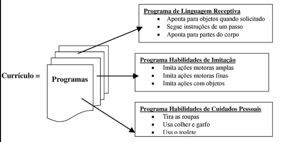

## O que é ABA? 

Análise do Comportamento Aplicada (Applied Behavior Analysis; abreviando: ABA) é um
termo advindo do campo científico do Behaviorismo, que observa, analisa e explica a
associação entre o ambiente, o comportamento humano e a aprendizagem.

Uma vez que um comportamento é analisado, um plano de ação pode ser implementado
para modificar aquele comportamento.O Behaviorismo concentra-se na análise objetiva
do comportamento observável e mensurável em oposição, por exemplo, à abordagem
psicanalítica, que assume que muito do nosso comportamento deve-se a processos
inconscientes. (Lembre-se de Freud!).

Ivan Pavlov, John B. Watson, Edward Thorndike e B.F. Skinner foram os pioneiros que
pesquisaram e descobriram os princípios científicos do Behaviorismo. São considerados
os “Pais do Behaviorismo”. 

O livro de B.F. Skinner, lançado em 1938, “The Behavior of Organisms” (O comportamento dos organismos), descrevia sua mais importante descoberta, o Condicionamento Operante, que é o que usamos atualmente para mudar ou modificar comportamentos e ajudar na aprendizagem. Condicionamento Operante significa que um comportamento seguido por um estímulo reforçador resulta em uma probabilidade aumentada de que aquele comportamento ocorra no futuro. Em português claro isso significa que, à medida que você vai levando a vida, vão lhe acontecendo coisas que vão aumentar ou diminuir a probabilidade de que você adote determinado comportamento no futuro. Por exemplo, se durante seu caminho para o trabalho você acena e sorri para o motorista do carro ao lado, e ele deixa que você atravesse na sua frente, você provavelmente vai tentar a mesma estratégia no dia seguinte. Seu comportamento de acenar e sorrir ficará mais freqüente, porque foi reforçado pelo outro motorista!

Todos nós aprendemos através de associações e nosso comportamento é “modificado”
através das conseqüências. Tentamos coisas e elas funcionam; então as fazemos
novamente. Tentamos coisas e elas não funcionam; então é menos provável que as façamos
novamente. Nosso comportamento foi “modificado” pelo resultado ou conseqüência.

Ao lado do Condicionamento Operante, Skinner pesquisou e descreveu os termos: SD
(Estímulo Discriminativo = Discriminative Stimulus), Reforçador (Reinforcer),
Controle de Estímulo (Stimulus Control), Extinção (Extinction), Esquemas de
Reforçamento (Schedules of Reinforcement) e Modelagem (Shaping). Todos esses
conceitos podem ser aplicados para trabalhar com uma vasta gama de comportamentos
humanos. 

ABA é um termo “guarda-chuva”, descreve uma abordagem científica que pode ser usada
para tratar muitas questões diferentes e cobrir muitos tipos diferentes de intervenções.
Educação, especificamente Educação Especial para crianças com autismo, é uma das
aplicações dessa ciência. 

## Como ABA é usada para ensinar crianças com autismo?

Para ensinar crianças com autismo, ABA é usada como base para instruções intensivas e
estruturadas em situação de um-para-um. Embora ABA seja um termo “guarda-chuva” que
englobe muitas aplicações, as pessoas usam o termo “ABA” como abreviação, para referirse apenas à metodologia de ensino para crianças com autismo. 

Um programa de ABA freqüentemente começa em casa, quando a criança é muito
pequena. A intervenção precoce é importante, mas esse tipo de técnica também pode
beneficiar crianças maiores e adultos. A metodologia, técnicas e currículo do programa
também podem ser aplicados na escola. A sessão de ABA normalmente é individual, em
situação de um-para-um, e a maioria das intervenções precoces seguem uma agenda de
ensino em período integral – algo entre 30 a 40 horas semanais. O programa é não aversivo – rejeita punições, concentrando-se na premiação do comportamento desejado. O
currículo a ser efetivamente seguido depende de cada criança em particular, mas
geralmente é amplo; cobrindo as habilidades acadêmicas, de linguagem, sociais, de
cuidados pessoais, motoras e de brincar. O intenso envolvimento da família no programa é
uma grande contribuição para o seu sucesso. 

## Visão geral de um programa de ABA (e o Lingo) 

Apresentamos aqui uma rápida visão geral dos elementos que compõem um programa de ABA. O restante do Ajude-nos a Aprender (Help Us Learn) vai explicar e elaborar cada uma dessas partes, com exemplos e exercícios.

### Currículo

O currículo usado será dividido em uma série de categorias, ou “programas”, tais como habilidades de cuidados pessoais, habilidades sociais, habilidades de linguagem, habilidades acadêmicas etc, organizadas em níveis de dificuldade, de maneira que você comece com habilidades básicas, muito simples, e depois as use para desenvolver as mais complexas. Os programas que você seleciona para trabalhar formam seu currículo:

Uma vez selecionados, os programas serão estabelecidos de maneira que todos saibam quais instruções dar, como apresentar os materiais que podem ser usados e qual resposta é aceitável. Há uma terminologia que geralmente é usada para ajudar nisso:

Estímulo / SD
- Conhecido e chamado de “SD” ou “Estímulo Discriminativo”.
- A instrução inicial, a exigência, ou comando a ser dado.
- Também conhecido como o antecedente.
- Especifica a fala e/ou a apresentação dos materiais.

Tentativa
- A seqüência completa de apresentar um SD, obter uma resposta (usando quantas
dicas/ajudas forem necessárias) e o reforçar da resposta.
- Unidade básica de um programa individual, que é praticada durante a sessão. 

Resposta
- A(s) resposta(s) esperada(s) e aceitável(is). 

Reforçador
- “Estímulo reforçador” abreviado para “SR+”
- também conhecido como reforçamento ou conseqüência.
- A conseqüência que segue imediatamente a resposta da criança. 

Ajudas/ Dicas
- Estímulos ou dicas suplementares dadas pelo professor.
- Usadas antes ou durante a execução do comportamento.

Estímulos
- Uma lista de palavras ou ações, uma coleção de materiais, itens, etc. que estão
sendo usados para determinado programa (por exemplo: figuras de animais, lista de
palavras para praticar, conjunto de blocos de montar, cartões de pistas). 

Aula
- O tempo de atividade gasto trabalhando com a criança no seu programa.
- Também chamada “sessão” por pessoas que preferem usar linguagem terapêutica. 

Domínio
- Os critérios que determinam quando a criança aprendeu a habilidade e está pronta
para seguir em frente.
- A maioria das pessoas está adotando o critério de “fluência” (100% correto e
rápido) das pesquisas de Comportamento Verbal.
- Outras pessoas podem preferir permanecer com o tradicional “80%, ou melhor, em
3 sessões sucessivas de 10 tentativas cada”. 

Dados
- Registrar simplesmente como a criança age em cada tentativa. A resposta de uma
criança a cada SD pode ser:
1. correta (indicada por um ‘+’ou um ‘9’)
2. incorreta (indicada por ‘-‘ ou um “x”)
3. sem resposta (indicada por um NR /SR)
4. Aproximação muito próxima (indicada por um ‘A’ ou você pode encontrar
‘S’, para Aproximação Sucessiva)
- Anotar dados e monitorar o progresso é uma parte vital da ABA. Se você não tiver
uma visão clara e acurada de como a criança está, você pode correr o risco de
frustrar e aborrecer a criança e você não vai saber quando está na hora de mudar
para um novo programa.

Método
- Descreve qualquer apresentação especial de material, lugar ou estrutura usada. 

## Referêcias

Copiado exatamente como está do livro: 

- [AJUDE-NOS A APRENDER – MANUAL DE TREINAMENTO EM ABA ]([htps://](http://www.recife.pe.gov.br/efaerpaulofreire/sites/default/files/arquivos/noticias/AADEE%20-%2020-JUL%20%20-%20TEA%20-%20APOSTILA%20-%20ABA.pdf))